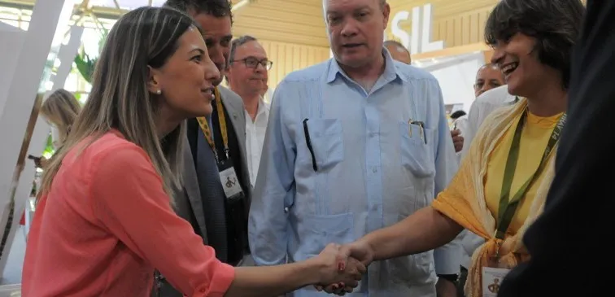
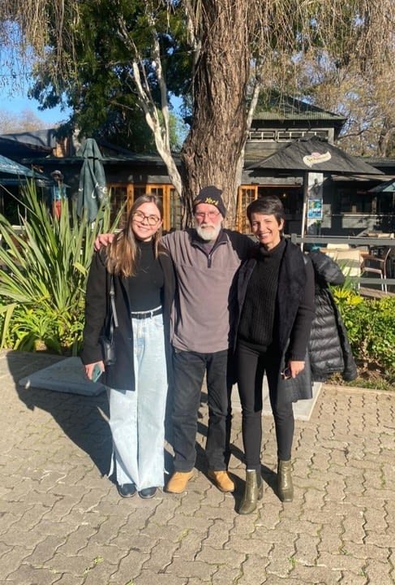

<section id="quem-somos" class="mt-4 mb-2">
  

    <h1>QUEM SOMOS</h1>
    <figure>
      
      <figcaption>2014 - FEIRA FIHAV, CUBA</figcaption>
    </figure>

  

  <ol class="bottom-text">
    <li>Somos movidas pela cultura exportadora, relacionamento global, diversidade cultural, inteligência comercial e vendas internacionais.</li>
    <li>Nossa história começou em 16/02/2016, focando inicialmente em produtos de linha branca. Com a experiência adquirida, expandimos para outros segmentos, incluindo produtos da agricultura familiar e acessórios femininos.</li>
    <li>Trabalhamos em parceria com fornecedores brasileiros, conectando exportadores e importadores globalmente através de nossa rede de relacionamentos.</li>
    <li>Nosso compromisso é fortalecer o comércio internacional, promovendo conexões duradouras e bem-sucedidas entre mercados ao redor do mundo.</li>
  </ol>
</section>

<section id="somos-brasilidade" class="d-flex mt-4 mb-2">
  <figure>
    
    <figcaption>2022 - VISITA TÉCNICA, ÁFRICA DO SUL</figcaption>
  </figure>

  

    <h1>SOMOS BRASILIDADE</h1>
    
Unindo nossas raízes brasileiras e valores, o nome <strong>Moara Exports</strong> tem origem Tupi-guarani e simboliza o senso de comunidade do nosso povo. Nosso propósito é fortalecer a coletividade, o trabalho e a dedicação de nossos parceiros além das fronteiras, enfatizando as relações humanas, a diversidade e o apoio para expandir a produção brasileira globalmente!

  

  
</section>
